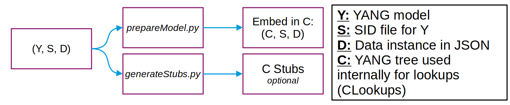

# ccoreconf

A C library for **CORECONF** ([RFC 9254](https://datatracker.ietf.org/doc/rfc9254/),
[draft-ietf-core-comi](https://datatracker.ietf.org/doc/draft-ietf-core-comi/)):
YANG data encoded in CBOR with SID identifiers, small enough for constrained
devices. It is one of the results of
[draft-toutain-t2t-sid-extension](https://datatracker.ietf.org/doc/draft-toutain-t2t-sid-extension/).

With ccoreconf you can:

1. **Load** one or more YANG models (as SID tables plus an instance) into a C program.
2. **Query** any node by SID, and by list keys for nodes inside YANG lists.
3. **Read and write** leaves, list entries and containers, optionally through generated handlers that call your own code.
4. **Encode and decode** the data as CORECONF CBOR, interoperable with [pycoreconf](https://github.com/alex-fddz/pycoreconf).

It runs on Linux and on [RIOT OS](#riot-os), through the [manojgudi/RIOT fork](https://github.com/manojgudi/RIOT/tree/25da06710084e6de9a85b1bc737dbe4f77e47b82),
tested on a RAK4631 sending CORECONF over LoRaWAN ([temperature_logger](https://github.com/manojgudi/temperature_logger/tree/e76830ad38d8c4a2dc67359c6768b977b30bee70)).

## Contents

- [Repository layout](#repository-layout)
- [Build](#build)
- [From a YANG model to a C program](#from-a-yang-model-to-a-c-program)
- [Using the library](#using-the-library)
- [Generated code](#generated-code)
- [CMake reference](#cmake-reference)
- [RIOT OS](#riot-os)
- [Tools](#tools)
- [Known limitations](#known-limitations)
- [Further reading](#further-reading)
- [AI Disclosure](#ai-disclosure)

## Repository layout

| Path | What it holds |
|---|---|
| `include/`, `src/` | The library |
| `tools/` | Python tools: `prepareModel.py`, `generateStubs.py`, `compareCoreconf.py`, `generateInstanceFromSid.py`; Jinja templates in `tools/templates/` |
| `cmake/` | `ccoreconfAddModel()` |
| `examples/multi_sid/` | Runnable example: two SCHC models (ietf-schc + ietf-schc-oam) in one program |
| `examples/temperature_sensor/` | Runnable example: a small model; loads it, reads leaves by SID and by YANG identifier, and updates one (voltageADC). Also the model used by the RIOT LoRaWAN app |
| `archive/` | Earlier documentation (`archive/docs/`) and models (`archive/old_models/`), kept for reference |
| `readme_img/` | Images used by this README |

Each example uses the same layout: `model/` (YANG and `.sid`), `instance/`
(instance data as JSON), `include_model/` (generated by `prepareModel.py`),
`stubs/` (generated by `generateStubs.py`).

## Build

Requirements: CMake ≥ 3.15, a C11 compiler, and [NanoCBOR](https://github.com/bergzand/NanoCBOR).

```sh
cmake -S . -B build
cmake --build build
```

If NanoCBOR is not installed system-wide, tell CMake where it is:

```sh
cmake -S . -B build -DNANOCBOR_INCLUDE=/path/to/NanoCBOR/include \
                    -DNANOCBOR_BUILD=/path/to/NanoCBOR/build
```

To build and run the examples:

```sh
# Simplest one: load a small model, print it, read leaves by SID and by identifier, update voltageADC
cmake -S examples/temperature_sensor -B build-temperature_sensor
cmake --build build-temperature_sensor
./build-temperature_sensor/temperature_demo

# Two SCHC models in one program, with nested lists
cmake -S examples/multi_sid -B build-multi_sid
cmake --build build-multi_sid
./build-multi_sid/schc_demo
```

## From a YANG model to a C program



**Y**: YANG model. **S**: SID file for Y. **D**: data instance in JSON.
**C**: YANG tree used internally for lookups (CLookups). The C stubs are optional.

The steps, using `examples/temperature_sensor` as the example; commands run
from the repository root unless noted. The Python tools need a virtual
environment:

```sh
python3 -m venv .venv
.venv/bin/pip install -r tools/requirements.txt
```

`tools/requirements.txt` pins pycoreconf and the
[ltn22 pyang fork](https://github.com/ltn22/pyang/tree/sid-extension);
upstream pyang lacks `--sid-extension`.

**1. Generate the `.sid` file** from the YANG module. `--sid-extension` adds
the leaf types and list keys that the tools need:

```sh
cd examples/temperature_sensor/model
../../../.venv/bin/pyang --sid-generate-file=60000:100 --sid-list --sid-extension TemperatureSensor.yang
```

**2. Write an instance** in YANG JSON ([RFC 7951](https://datatracker.ietf.org/doc/rfc7951/))
and check it against the model. The instance is the data your embedded
device holds and typically sends over the network, encoded as CORECONF
CBOR (22 bytes for this one) instead of JSON:

```json
{
  "TemperatureSensor:TemperatureSensorObject": {
    "statusLED": "green",
    "batteryLevel": 87,
    "temperature": { "voltageADC": "1.8" }
  }
}
```

```sh
cd examples/temperature_sensor
yanglint -p model model/TemperatureSensor.yang instance/TemperatureSensor.json
```

[`yanglint`](https://github.com/CESNET/libyang) comes with libyang. Version
2.0 exits with 0 even when the data is invalid; read its messages.

**3. Turn the model into C** (`prepareModel.py`): SID, key and parent tables
plus the instance encoded as CBOR.

```sh
.venv/bin/python tools/prepareModel.py \
    --sid-files  examples/temperature_sensor/model/TemperatureSensor.sid \
    --instance   examples/temperature_sensor/instance/TemperatureSensor.json \
    --name       test-temperature-sensor \
    --output-dir examples/temperature_sensor/include_model
```

Several models at once (multi-SID), as in `examples/multi_sid`: list all their `.sid` files.

```sh
.venv/bin/python tools/prepareModel.py --sid-files examples/multi_sid/model/ietf-schc@2023-01-28.sid examples/multi_sid/model/ietf-schc-oam@2021-11-10.sid --instance examples/multi_sid/instance/schc.json --name test-schc --output-dir examples/multi_sid/include_model
```

**4. Generate the stubs** (`generateStubs.py`), only if you want handlers
that call your code on reads and writes:

```sh
.venv/bin/python tools/generateStubs.py test-temperature-sensor \
    -f examples/temperature_sensor/model/TemperatureSensor.sid \
    --output-dir examples/temperature_sensor/stubs
```

Multi-SID:

```sh
.venv/bin/python tools/generateStubs.py test-schc -f examples/multi_sid/model/ietf-schc@2023-01-28.sid examples/multi_sid/model/ietf-schc-oam@2021-11-10.sid --output-dir examples/multi_sid/stubs
```

**5. Use it from C**: see the next section.

## Using the library

```c
#include <stdio.h>
#include "serialization.h"
#include "test-temperature-sensor.h"           /* generated by prepareModel.py */
#include "test-temperature-sensor-handlers.h"  /* generated by generateStubs.py */

int main(void)
{
    /* 1. Load the model: tables + instance CBOR compiled into the program */
    CoreconfModelT *model = ccoreconfModelLoadDesc(&testTemperatureSensorModelDesc);
    testTemperatureSensorRegisterHandlers(model);

    /* 2. Read a leaf: find its path, then examine the model */
    uint64_t SID = SID_TEST_TEMPERATURE_SENSOR_BATTERYLEVEL;
    PathNodeT *path = ccoreconfModelFindRequirementForSID(model, SID);
    CoreconfValueT *hit = ccoreconfModelExamineCoreconfValue(model, NULL, path);
    printf("batteryLevel = %lu\n",
           (unsigned long)getCoreconfValueAsUint64(getCoreconfHashMap(hit->data.map_value, SID)));
    freeExaminedCoreconfValue(hit);   /* frees the wrapper only, not the model's data */

    /* 3. Write a leaf through its generated handler; the model takes `value` */
    SIDHandlerContextT ctx = { .SID = SID, .keys = NULL, .pathNode = path, .model = model };
    CoreconfValueT *value = createCoreconfUint8(42);
    if (ccoreconfModelLookupHandler(model, SID)->writeHandler(&ctx, value) != 0) {
        freeCoreconf(value, true);    /* rejected: still ours to free */
    }
    freePathNode(path);

    /* 4. Encode the whole model to CORECONF CBOR */
    uint8_t buf[64];
    nanocbor_encoder_t enc;
    nanocbor_encoder_init(&enc, buf, sizeof(buf));
    coreconfToCBOR(model->root, &enc);
    printf("%zu bytes of CORECONF CBOR\n", nanocbor_encoded_len(&enc));

    ccoreconfModelFree(model);
    return 0;
}
```

Compile with `-DCCORECONF_ENABLE_SID_MACROS` to get the `SID_*` macros.

### Nodes inside YANG lists: keys

A node inside one or more lists is addressed by its SID **and** the keys of
every enclosing list. Keys go in a `DynamicLongListT` that ccoreconf reads
**from the end**: outermost list first, each list's keys in the order of the
`.sid` file's key-mapping. For SCHC `rule/entry/field-length`, that is
rule-id-value, rule-id-length, field-id, field-position, direction-indicator,
so they are added in reverse:

```c
DynamicLongListT *keys = createDynamicLongList();
addLong(keys, directionIndicator);
addLong(keys, fieldPosition);
addLong(keys, fieldId);
addLong(keys, ruleIdLength);
addLong(keys, ruleIdValue);
```

Every key must match: too few keys, extra keys, or an entry without a key
leaf give "not found" (NULL).

### Who frees what

| You get | From | Free it with |
|---|---|---|
| `CoreconfModelT *` | `ccoreconfModelLoadDesc()` | `ccoreconfModelFree()` |
| `PathNodeT *` | `ccoreconfModelFindRequirementForSID()` | `freePathNode()` |
| query result | `ccoreconfModelExamineCoreconfValue()` | `freeExaminedCoreconfValue()`: the result points into the model; never `freeCoreconf()` it |
| `DynamicLongListT *` | `createDynamicLongList()` | `freeDynamicLongList()` |
| decoded value | `cborToCoreconfValue()` | `freeCoreconf(value, true)` |
| value passed to a write | `create*()` | nobody if the write succeeded (the model owns it); you, if it failed |

### Writes replace

A write **replaces** its target: a leaf gets the new value, and a container
or list entry becomes exactly the written value (children left out are
removed). A list-entry write replaces the entry whose keys all match, or adds
a new entry. Writes never merge.

## Generated code

`generateStubs.py <name>` writes four files:

| File | Edit it? | Contents |
|---|---|---|
| `<name>-handlers.c/.h` | No; regenerate instead | `handler_read_<SID>` / `handler_write_<SID>` for each node, and `<name>RegisterHandlers(model)` |
| `<name>-impl.h` | No | Prototypes of your functions |
| `<name>-impl-template.c` | Copy it once to `<name>-impl.c`, then edit the copy | Your `read_*` / `write_*` functions, as stubs |

A write handler checks the value's type, calls your `write_*` function, and
updates the model if your function returns 0. Your functions receive the keys
of every enclosing list, outermost first, for example:

```c
int write_entry_matchingOperator(uint64_t rule_ruleIdValue, uint64_t rule_ruleIdLength,
                                 uint64_t entry_fieldId, uint64_t entry_fieldPosition,
                                 uint64_t entry_directionIndicator, uint64_t value);
```

Integers are passed as `uint64_t` / `int64_t`. Containers, lists, unions and
`binary` leaves are passed as `CoreconfValueT *`. Regenerate the stubs after
changing the model or updating ccoreconf; a regenerated `*-impl.h` may change
your functions' signatures.

## CMake reference

| Option | Default | Effect |
|---|:-:|---|
| `BUILD_SHARED_LIBS` | OFF | Shared instead of static library |
| `CWARN_AS_ERROR` | ON | Warnings are errors |
| `CCORECONF_SANITIZE` | OFF | Build with AddressSanitizer + UndefinedBehaviorSanitizer |
| `NANOCBOR_INCLUDE`, `NANOCBOR_BUILD` | unset | Where NanoCBOR's headers and library are (also read from the environment) |

**In another CMake project**, add ccoreconf as a subdirectory and let it
generate your model at build time:

```cmake
add_subdirectory(path/to/ccoreconf ccoreconf)
ccoreconfAddModel(sensor SID_FILES model/sensor.sid INSTANCE instance/sensor.json)
target_link_libraries(my_app PRIVATE ccoreconf ccoreconf_model_sensor)
```

Set `-DCCORECONF_PYTHON=/path/to/.venv/bin/python` so it uses the venv with
`tools/requirements.txt`.

**Installing**: `cmake --install build` puts the library in `<prefix>/lib`,
the headers in `<prefix>/include/ccoreconf/`, and a package for
`find_package(ccoreconf)` in `<prefix>/lib/cmake/ccoreconf/`.

## RIOT OS

ccoreconf is a RIOT package in the
[manojgudi/RIOT fork](https://github.com/manojgudi/RIOT/tree/25da06710084e6de9a85b1bc737dbe4f77e47b82),
`pkg/ccoreconf`. Use it with `USEPKG += ccoreconf`; RIOT fetches the commit
pinned in `pkg/ccoreconf/Makefile` (`PKG_VERSION`). To build against a local
checkout instead:

```sh
make PKG_SOURCE_LOCAL_CCORECONF=/path/to/ccoreconf
```

The package carries a small NanoCBOR compatibility shim, because RIOT pins
an older NanoCBOR whose `nanocbor_leave_container()` returns `void`.

A working application for the RAK4631 (nRF52840 + SX1262), sending CORECONF
over LoRaWAN, is [temperature_logger](https://github.com/manojgudi/temperature_logger/tree/e76830ad38d8c4a2dc67359c6768b977b30bee70): it fills
`examples/temperature_sensor` with random values through the generated
handlers. It was tested with the RIOT fork at [`25da067`](https://github.com/manojgudi/RIOT/tree/25da06710084e6de9a85b1bc737dbe4f77e47b82), which pins
ccoreconf `db3de90`.

## Tools

| Tool | Does |
|---|---|
| `prepareModel.py` | `.sid` files + instance JSON → `<name>.c/.h` (tables and instance CBOR) |
| `generateStubs.py` | `.sid` files → handlers and user stubs; `--output-dir` chooses where |
| `compareCoreconf.py` | Checks that a CBOR file holds the same data as an instance JSON (via pycoreconf); prints `SAME DATA` or the differences |
| `generateInstanceFromSid.py` | `.sid` files → a skeleton instance JSON with every node and default values, to fill in |

Run any of them with `--help` for their options.

## Known limitations

- **String-keyed lists** cannot be addressed: request keys are `long` values.
- **`decimal64`** is carried as a CBOR float (as pycoreconf does), not as the RFC 9254 decimal fraction ([#6](https://github.com/manojgudi/ccoreconf/issues/6)).
- **Enumerations** get no generated handlers yet; set them with `navigateToParentContainer()` + `insertCoreconfHashMap()`.
- **Generated read handlers** of top-level leaves leave `ctx` unused, which fails builds with `-Wextra -Werror`.
- **Fixed sizes**: `HASHMAP_TABLE_SIZE` (100) and `CORECONF_MAX_DEPTH` (20) are compile-time constants ([#7](https://github.com/manojgudi/ccoreconf/issues/7)).
- **Memory** is allocated dynamically at runtime ([#21](https://github.com/manojgudi/ccoreconf/issues/21)).

## Further reading

- [RFC 9254](https://datatracker.ietf.org/doc/rfc9254/): CBOR encoding of YANG data, SIDs
- [pycoreconf](https://github.com/alex-fddz/pycoreconf): the Python implementation ccoreconf interoperates with
- [openschc](https://github.com/openschc/openschc)
- [Video introduction](https://www.youtube.com/watch?v=pE5NI83k3Xk&t=437s) to querying CORECONF models by [@ltn22](https://github.com/ltn22/)
- `archive/docs/`: the earlier READMEs, including the generator walkthrough with screenshots (*obsolete*)

## AI Disclosure

Most of this code and documentation was written with MiniMax M3 and Claude
Opus 5.5, and reviewed and tested extensively by the authors.

## License

MIT, see [LICENSE](LICENSE). `src/hashmap.c` and `include/hashmap.h` are from [tidwall/hashmap.c](https://github.com/tidwall/hashmap.c), also MIT.
