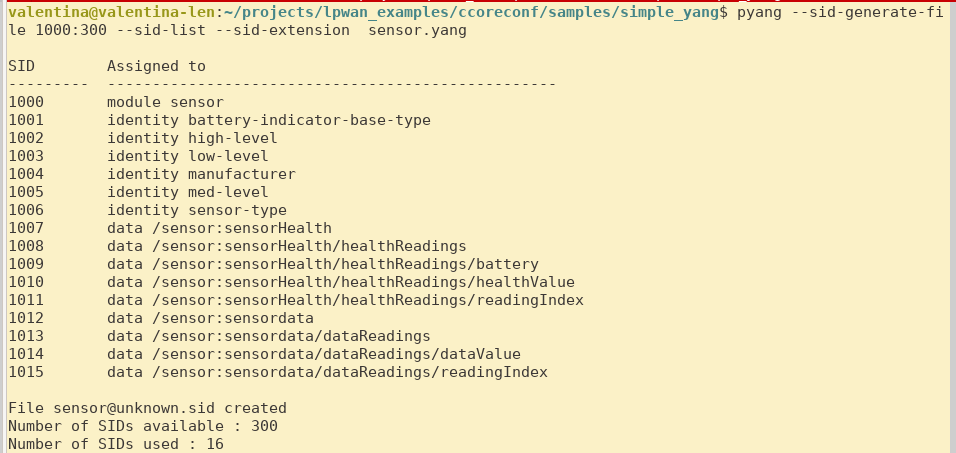
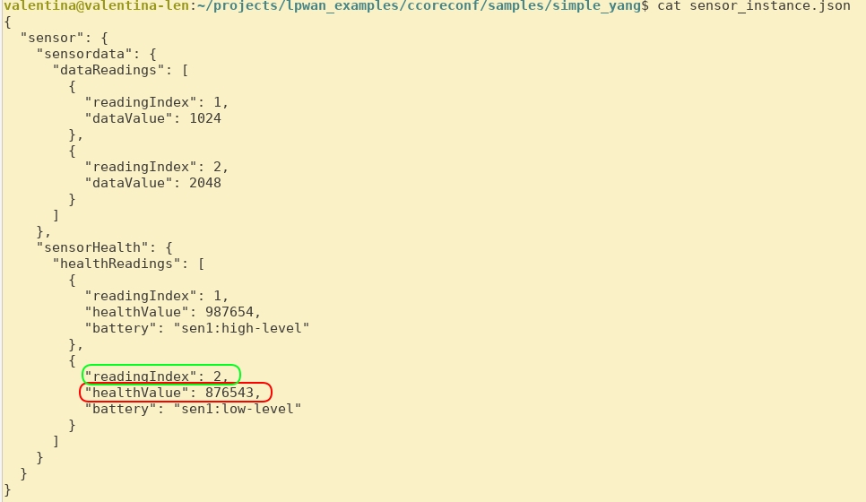
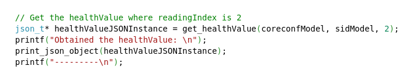
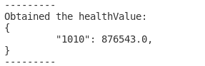

# What is generateStubs.py and how to use it?

## Generating Stubs

_generateStubs.py_ is a tool used to generate C _getter_ function stubs for the leaves of our YANG model. These functions hide the internal SID references and correctly deduce the keys required to reach our leaves.

0. Firstly, install the dependencies included in the _~/tools_ folder
   `$ pip install -r requirements.txt`
1. To run the the function, you will require to install the [ccoreconf](https://github.com/manojgudi/ccoreconf) library.

1. Then, generate the SID file for your YANG model using _pyang_ tool, here's a [quick tutorial](https://github.com/alex-fddz/pycoreconf/tree/main#requirements--setup) in using SID extension for pyang. Here's an example for the [sensor.yang](https://github.com/manojgudi/ccoreconf/blob/stub_generation/samples/simple_yang/sensor.yang) model

`$ pyang --sid-generate-file 1000:300 --sid-list --sid-extension  sensor.yang`

2. Run the _generateStubs.py_ for the SID file, and it prints the auto-generated on the _stdout_. You can pipe it out to a file like this:

`$ python3 generateStubs.py ../samples/simple_yang/sensor@unknown.sid  > prototypes.c`

## Understanding Stubs

Let's try to understand what is the generated C function stub is trying to do. Suppose the **objective** of an user is to programmatically get value of the leaf _healthValue_  (at position 2) from [sensor_instance.json](https://github.com/manojgudi/ccoreconf/blob/stub_generation/samples/simple_yang/sensor_instance.json) file. Note, in a real-embedded system, this json data can be encoded in CBOR as well, and received from a CoAP request from a controller.

So, for example it will be, the *_healthvalue* at the 2nd position is 876543, and according to our [YANG model](https://github.com/manojgudi/ccoreconf/blob/stub_generation/samples/simple_yang/sensor.yang) it is indexed by the SID key _readingIndex_.

And let us take a look at the C Stub generated:

Here the _get_healthValue_ function is a similar to a _getter_ function which takes in:

* `json_t*` tree of [sensor_instance.json](https://github.com/manojgudi/ccoreconf/blob/stub_generation/samples/simple_yang/sensor_instance.json) file. `json_t`  type is defined in [Jansson library](https://jansson.readthedocs.io/), 
* `SIDModelT *` instance defined by the _ccoreconf_ library which contains information about SID key mappings. You can build as shown in the [the demo_functionalities.c](https://github.com/manojgudi/ccoreconf/blob/stub_generation/examples/demo_functionalities.c#L51) file
* `uint8_t` type of value for the key for _healthValue_, which in this case is _readingIndex_. 

Internally it makes use of the key-mapping, sets the correct Identifier for querying _healthValue_ and calls [traverseCORECONFWithKeys](https://github.com/manojgudi/ccoreconf/blob/stub_generation/src/ccoreconf.c#L640) method defined from _ccoreconf_ library. 

Lastly, this function returns the `json_t* ` instance containing _healthValue_ if it exists, else the pointer returns to NULL.

This function easily be integrated in your _main.c_ like this:

And if you run your _main.c_, you'll see the output like:

---------

Please feel free to leave a comment or bug-report in case you find any issue.