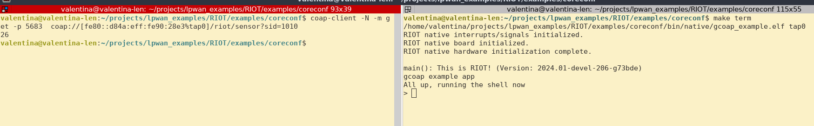

# What is generateStubs.py and how to use it?

## Generating Stubs

_generateStubs.py_ is a tool used to generate C _getter_ function stubs for the leaves of our YANG model. These functions hide the internal SID references and correctly deduce the keys required to reach our leaves.

0. Firstly, install the dependencies included in the _~/tools_ folder
   `$ pip install -r requirements.txt`
1. To run the the function, you will require to install the [ccoreconf](https://github.com/manojgudi/ccoreconf) library.

1. Then, generate the SID file for your YANG model using _pyang_ tool, here's a [quick tutorial](https://github.com/alex-fddz/pycoreconf/tree/main#requirements--setup) in using SID extension for pyang. Here's an example for the [sensor.yang](https://github.com/manojgudi/ccoreconf/blob/stub_generation/samples/simple_yang/sensor.yang) model

`$ pyang --sid-generate-file 1000:300 --sid-list --sid-extension  sensor.yang`


3. Run the _generateStubs.py_ for the SID file, pass it a _module-name_ , the tool will  print the auto-generated on the _stdout_ and create two files: 

   _module-name.h_ containing the header definitions and function declarations, and _module-name.c_ containing function-body stubs which user can implement.

`$ python3 generateStubs.py ../samples/simple_yang/sensor@unknown.sid  sid_prototypes`


## Understanding Stubs

Let us try to understand what is generated by the tool. Let us take a look at the contents of _sid_prototypes.h_ 

```c
#include <stdlib.h>
#include <stdint.h>
#include <stdbool.h>
#include <string.h>

// SID mapping of all the leaves for quick and easy access
#define  SID_BATTERY             1009
#define  SID_HEALTHVALUE         1010
#define  SID_READINGINDEX        1011
#define  SID_DATAVALUE           1014
#define  SID_READINGINDEX1       1015

// Function aliases of the function names for quick access
#define read_sensorHealth        read_1007
#define read_healthReadings      read_1008
#define read_healthValue         read_1010
#define read_sensordata          read_1012
#define read_dataReadings        read_1013
#define read_dataValue           read_1014

// Function prototypes of the getters
void read_sensorHealth(void);
void read_healthReadings(uint8_t readingIndex);
uint32_t read_healthValue(uint8_t readingIndex);
void read_sensordata(void);
void read_dataReadings(uint8_t readingIndex);
uint16_t read_dataValue(uint8_t readingIndex);

```

Now let us understand what is generated in _sid_prototypes.c_ by looking at autogenerated function _read_healthValue_ intended to implemented by the user on a sensor.

```c
/*
    This is an autogenerated function associated to 
    SID: 1010
    Module: data 
    Identifier: /sensor:sensorHealth/healthReadings/healthValue
    function params: /sensor:sensorHealth/healthReadings/readingIndex
    Stable: false
*/
uint32_t read_healthValue(uint8_t readingIndex){
    // Initialize the leaf if it has a return type with a default value;
    uint32_t healthValueInstance  = 0;
	
    // Do something with the leaf
    // Return the leaf 
    readingIndex++;
    return healthValueInstance;
}
        
```

As you can see, it is pretty self explanatory.

## Implementing it in RIOT OS project

Suppose the **objective** of an user is to perform a simple CoAP GET query his/her sensor to get its health value. Let's see how to do that using RIOT OS. 

1. We will clone [gcoap](https://github.com/RIOT-OS/RIOT/tree/master/examples/gcoap) example from the RIOT OS example directory to modify as it contains almost everything we need. We place our two files in the project directory-  _sid_prototypes.h_ and _sid_prototypes.c_

2. We modify _read_healthValue_ function body such as this _sid_prototypes.c_  and add a new function _adc_sample_ to emulate a sensor reading data from its ADC pin/channel.

   ```c
   /*
   This function is NOT autogenerated
   Emulate a sensor reading, similar to i2c/analog read functions, takes a pin/channel number
   */
   int adc_sample(int channel){
       // Return an arbitrary number
       return 1 + channel;
   }
   ```

   And then we use the key of the leaf _readingIndex_ to select an appropriate channel using switch case in the _read_healthValue_ like so:

   ```c
   /*
       This is an autogenerated function associated to 
       SID: 1010
       Module: data 
       Identifier: /sensor:sensorHealth/healthReadings/healthValue
       function params: /sensor:sensorHealth/healthReadings/readingIndex
       Stable: false
   */
   uint32_t read_healthValue(uint8_t readingIndex){
       // Initialize the leaf if it has a return type with a default value;
       uint32_t healthValueInstance  = 0;
   
       // Do something with the leaf
       switch (readingIndex){
           case 1:
               // If readingIndex is 1, get health value from channel 25
               healthValueInstance = (uint32_t) adc_sample(25);
               break;
           case 2:
               // If readingIndex is 2, get health value from channel 27
               healthValueInstance = (uint32_t) adc_sample(27);
               break;
           default:
               // Do nothing, healthValueInstance will be returned with its default value
               break;
       }
       // Return the leaf 
       return healthValueInstance;
   }
   ```

   3. Now we make changes to _server.c_ included with the example to add a specific route and we will perform a _read_healthValue_ function call ONLY if the query parameters match the SID_HEALTHVALUE and return its output as the response.

      ```c
          /***TRUNCATED****/
      	switch (method_flag) {
              case COAP_GET:
                  // Compare if the query parameters is for SID_HEALTHVALUE
                  if (! strcmp((char *) query_tmp, path_tmp) ){
                      uint32_t healthValue = read_healthValue(1);
      
                      // The "+1" is for the null terminator
                      int max_chars = snprintf(NULL, 0, "%u", healthValue) + 1;
      
                      // Allocate memory for the string
                      char *str_value = (char *)malloc(max_chars);
                      if (str_value == NULL) {
                          // Handle memory allocation failure
                          return 1;
                      }
                     // Convert uint32_t to string
                     snprintf(str_value, max_chars, "%u", healthValue);
         
                      gcoap_resp_init(pdu, buf, len, COAP_CODE_CONTENT);
                      coap_opt_add_format(pdu, COAP_FORMAT_TEXT);
                      size_t resp_len = coap_opt_finish(pdu, COAP_OPT_FINISH_PAYLOAD);
      
                      /* write the RIOT board name in the response buffer */
                      if (pdu->payload_len >=  strlen(str_value)) {
                          memcpy(pdu->payload, str_value, strlen(str_value));
                          return resp_len + strlen(str_value);
                      }
                     else {
                          return gcoap_response(pdu, buf, len, COAP_CODE_BAD_REQUEST);
                      }
                  }
                  gcoap_resp_init(pdu, buf, len, COAP_CODE_CONTENT);
                  coap_opt_add_format(pdu, COAP_FORMAT_TEXT);
                  size_t resp_len = coap_opt_finish(pdu, COAP_OPT_FINISH_PAYLOAD);
      
                  /* write the response buffer with the request count value */
                  resp_len += fmt_u16_dec((char *)pdu->payload, req_count);
                  return resp_len;
      /*** TRUNCATED ***/ 
      ```


### Quick demo

You may quickly build this RIOT example-project on native platform and perform a quick CoAP request to check.

1. Run `make` on the project to build it successfully and then `make term` to start the CoAP server _natively_.

2. Install _libcoap_ if you don't have it already, on Ubuntu like systems, its as easy as:

   `$ sudo apt install libcoap3 libcoap3-dev `

3. Perform a CoAP request from your host machine to the emulated sensor running natively:



And as you can see for sid=1010, the sensors queries the health value and returns the value from ADC (which is 26).


The RIOT OS project demo can be found [here](https://github.com/manojgudi/RIOT/tree/master/examples/coreconf)


_Please feel free to leave a comment or bug-report in case you find any issue._
