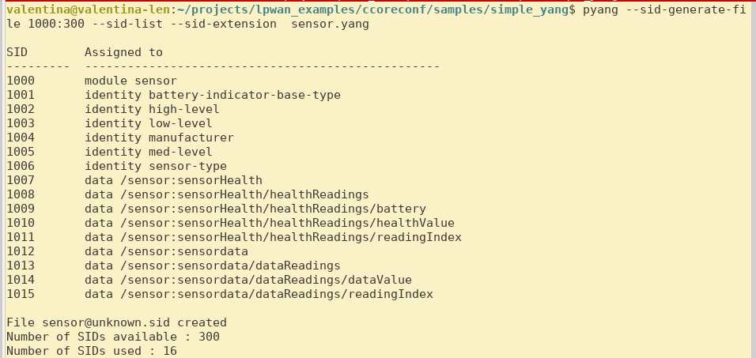
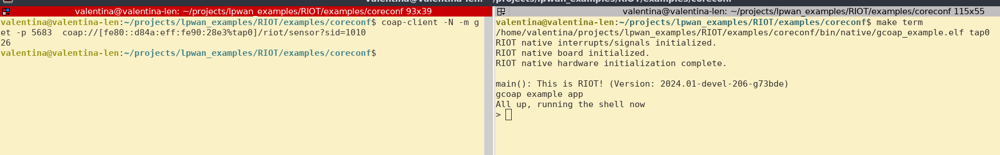

# What is generateStubs.py and how to use it?

## Overview

_generateStubs.py_ is a tool used to generate C handler functions and implementation stubs for YANG data models. It generates two sets of files:

1. **Handler wrappers** (`*-handlers.c/h`): Auto-generated handler functions that integrate with the CORECONF server framework
2. **Implementation stubs** (`*-impl-template.c/h`): Template functions for users to implement their read/write business logic

These generated functions hide the internal SID references and correctly deduce the keys required to reach YANG leaves.

## Generating Stubs

0. Firstly, install the dependencies included in the _~/tools_ folder
   `$ pip install -r requirements.txt`
1. To run the the function, you will require to install the [ccoreconf](https://github.com/manojgudi/ccoreconf) library.

1. Then, generate the SID file for your YANG model using _pyang_ tool, here's a [quick tutorial](https://github.com/alex-fddz/pycoreconf/tree/main#requirements--setup) in using SID extension for pyang. Here's an example for the [sensor.yang](https://github.com/manojgudi/ccoreconf/blob/stub_generation/samples/simple_yang/sensor.yang) model

`$ pyang --sid-generate-file 1000:300 --sid-list --sid-extension  sensor.yang`



3. Run the _generateStubs.py_ for the SID file, pass it a _module-name_ , the tool will  print the auto-generated on the _stdout_ and create two files: 

   _module-name.h_ containing the header definitions and function declarations, and _module-name.c_ containing function-body stubs which user can implement.

`$ python3 generateStubs.py ../samples/simple_yang/sensor@unknown.sid  sid_prototypes`


## Understanding Generated Code

The tool generates four files. Let's examine each to understand the code structure:

### Implementation Header (`sid_prototypes-impl-template.h`)

```c
#ifndef __SID_PROTOTYPES_IMPL_H__
#define __SID_PROTOTYPES_IMPL_H__

#include <stdlib.h>
#include <stdint.h>
#include <stdbool.h>
#include <string.h>
#include <coreconfTypes.h>

// Function aliases for quick access
#define read_sensorHealth_healthReadings read_1009
#define write_sensorHealth_healthReadings write_1009

// Function prototypes - note all integers are uint64_t/int64_t
CoreconfValueT* read_sensorHealth_healthReadings(uint64_t healthReadings_readingIndex);
int write_sensorHealth_healthReadings(uint64_t healthReadings_readingIndex, CoreconfValueT* value);

#define read_healthReadings_healthValue read_1011
#define write_healthReadings_healthValue write_1011
uint64_t read_healthReadings_healthValue(void);
int write_healthReadings_healthValue(uint64_t value);

// User-facing read/write function prototypes
// Implement these functions in your code

#endif
```

Key points:
- All integer types are 64-bit (`uint64_t`/`int64_t`) to avoid union member access bugs
- Function aliases map readable names to SID-based names
- List items return/accept `CoreconfValueT*` for complex structures

### Implementation Source (`sid_prototypes-impl-template.c`)

```c
#include "sid_prototypes-impl.h"

/*
    This is an autogenerated function associated to
    SID: 1011
    Module: data
    Identifier: /sensor:sensor/sensorHealth/healthReadings/healthValue
    function params:
    Stable: False
*/
uint64_t read_healthReadings_healthValue(void) {
    // TODO: replace with proper return value for the leaf
    uint64_t mockValue = 0;
    return mockValue;
}

int write_healthReadings_healthValue(uint64_t value) {
    // TODO: Implement write logic for this SID
    // Validate value, update hardware/database, etc.
    return 0;  // Return 0 for success, -1 for failure
}
```

This is where you implement your business logic. The function stubs include:
- Documentation comments with SID, module, and identifier info
- Placeholder implementations to get you started
- Clear return value conventions (0 = success, -1 = failure for writes)

### Handler Header (`sid_prototypes-handlers.h`)

```c
#ifndef __SID_PROTOTYPES_HANDLERS_H__
#define __SID_PROTOTYPES_HANDLERS_H__

#include <sid_handlers.h>
#include <coreconfTypes.h>

// Handler wrappers that integrate with CORECONF server
CoreconfValueT* handler_read_1011(SidHandlerContext *ctx);
int handler_write_1011(SidHandlerContext *ctx, CoreconfValueT *value);

// Handler registration function
void registerGeneratedHandlers(void);
#endif
```

### Handler Source (`sid_prototypes-handlers.c`)

```c
CoreconfValueT* handler_read_1011(SidHandlerContext *ctx) {
    // Call user-implemented read function
    uint64_t result = read_healthReadings_healthValue();

    // Convert native type to CoreconfValueT
    return examineCoreconfValue(ctx->coreconfModel, ctx->keys, ctx->pathNode);
}

int handler_write_1011(SidHandlerContext *ctx, CoreconfValueT *value) {
    // Validate value type (uses type-safe helper)
    if (!isTypeUint(value->type)) {
        printf("Error: Expected unsigned integer type for SID 1011\n");
        return -1;
    }

    // Extract native value using helper function
    uint64_t nativeValue = getCoreconfValueAsUint64(value);

    // Call user-implemented write function
    int result = write_healthReadings_healthValue(nativeValue);

    // If user function succeeded, update the datastore
    if (result == 0) {
        uint64_t finalDeltaSID = 0;
        CoreconfValueT* parentContainer = navigateToParentContainer(
            ctx->coreconfModel, ctx->pathNode, 1011, &finalDeltaSID);

        if (parentContainer != NULL) {
            int insertResult = insertCoreconfHashMap(
                parentContainer->data.map_value, finalDeltaSID, value);
            if (insertResult != 0) {
                printf("Warning: Failed to update coreconfModel for SID 1011\n");
            }
        }
    }

    return result;
}
```

Key features:
- Handlers bridge between CORECONF protocol and user implementation
- Type validation uses `isTypeUint()`/`isTypeInt()` helpers
- Value extraction uses `getCoreconfValueAsUint64()`/`getCoreconfValueAsInt64()`
- Automatic datastore updates on successful writes
- Memory ownership transferred to datastore on success (value not freed)

## Important Implementation Details

### Type Mapping and 64-bit Integer Usage

To avoid issues with accessing incorrect union members in `CoreconfValueT`, the code generator now maps all integer types to their 64-bit equivalents:

- `uint8`, `uint16`, `uint32` → `uint64_t`
- `int8`, `int16`, `int32` → `int64_t`

This approach ensures that:
1. No garbage values are read when accessing union members
2. No memory corruption occurs from writing to the wrong union field
3. The code is more robust and maintainable

### Helper Functions for Type-Safe Access

The generated handler code uses type-safe helper functions:

- `getCoreconfValueAsUint64(value)` - Extracts unsigned integer regardless of size (uint8/16/32/64)
- `getCoreconfValueAsInt64(value)` - Extracts signed integer regardless of size (int8/16/32/64)
- `isTypeUint(type)` - Validates that a value is any unsigned integer type
- `isTypeInt(type)` - Validates that a value is any signed integer type

These helpers automatically handle the type checking and extract from the correct union member, preventing common bugs.

### Handler Wrapper Structure

For each data node, the generator creates:

**Read Handler** (`handler_read_<SID>`):
- Extracts keys from `SidHandlerContext`
- Calls user implementation function
- Returns `CoreconfValueT*` from datastore

**Write Handler** (`handler_write_<SID>`):
- Validates incoming value type using type helper functions
- Extracts native value using `getCoreconfValueAs*()` helpers
- Calls user implementation function
- Updates the in-memory datastore if successful
- **Important**: Does NOT free the value on success (ownership transferred to datastore)

### Memory Management

The generated write handlers follow this pattern:
- If write succeeds: Value is inserted into datastore (ownership transfer, do NOT free)
- If write fails: Value should be freed by the caller
- This prevents use-after-free bugs and dangling pointers

## Implementing it in RIOT OS project

Suppose the **objective** of an user is to perform a simple CoAP GET query his/her sensor to get its health value. Let's see how to do that using RIOT OS. 

1. We will clone [gcoap](https://github.com/RIOT-OS/RIOT/tree/master/examples/gcoap) example from the RIOT OS example directory to modify as it contains almost everything we need. We place our two files in the project directory-  _sid_prototypes.h_ and _sid_prototypes.c_

2. We modify _read_healthValue_ function body such as this _sid_prototypes.c_  and add a new function _adc_sample_ to emulate a sensor reading data from its ADC pin/channel.

   ```c
   /*
   This function is NOT autogenerated
   Emulate a sensor reading, similar to i2c/analog read functions, takes a pin/channel number
   */
   int adc_sample(int channel){
       // Return an arbitrary number
       return 1 + channel;
   }
   ```

   And then we use the key of the leaf _readingIndex_ to select an appropriate channel using switch case in the _read_healthValue_ like so:

   ```c
   /*
       This is an autogenerated function associated to 
       SID: 1010
       Module: data 
       Identifier: /sensor:sensorHealth/healthReadings/healthValue
       function params: /sensor:sensorHealth/healthReadings/readingIndex
       Stable: false
   */
   uint32_t read_healthValue(uint8_t readingIndex){
       // Initialize the leaf if it has a return type with a default value;
       uint32_t healthValueInstance  = 0;
   
       // Do something with the leaf
       switch (readingIndex){
           case 1:
               // If readingIndex is 1, get health value from channel 25
               healthValueInstance = (uint32_t) adc_sample(25);
               break;
           case 2:
               // If readingIndex is 2, get health value from channel 27
               healthValueInstance = (uint32_t) adc_sample(27);
               break;
           default:
               // Do nothing, healthValueInstance will be returned with its default value
               break;
       }
       // Return the leaf 
       return healthValueInstance;
   }
   ```

   3. Now we make changes to _server.c_ included with the example to add a specific route and we will perform a _read_healthValue_ function call ONLY if the query parameters match the SID_HEALTHVALUE and return its output as the response.

      ```c
          /***TRUNCATED****/
      	switch (method_flag) {
              case COAP_GET:
                  // Compare if the query parameters is for SID_HEALTHVALUE
                  if (! strcmp((char *) query_tmp, path_tmp) ){
                      uint32_t healthValue = read_healthValue(1);
      
                      // The "+1" is for the null terminator
                      int max_chars = snprintf(NULL, 0, "%u", healthValue) + 1;
      
                      // Allocate memory for the string
                      char *str_value = (char *)malloc(max_chars);
                      if (str_value == NULL) {
                          // Handle memory allocation failure
                          return 1;
                      }
                     // Convert uint32_t to string
                     snprintf(str_value, max_chars, "%u", healthValue);
         
                      gcoap_resp_init(pdu, buf, len, COAP_CODE_CONTENT);
                      coap_opt_add_format(pdu, COAP_FORMAT_TEXT);
                      size_t resp_len = coap_opt_finish(pdu, COAP_OPT_FINISH_PAYLOAD);
      
                      /* write the RIOT board name in the response buffer */
                      if (pdu->payload_len >=  strlen(str_value)) {
                          memcpy(pdu->payload, str_value, strlen(str_value));
                          return resp_len + strlen(str_value);
                      }
                     else {
                          return gcoap_response(pdu, buf, len, COAP_CODE_BAD_REQUEST);
                      }
                  }
                  gcoap_resp_init(pdu, buf, len, COAP_CODE_CONTENT);
                  coap_opt_add_format(pdu, COAP_FORMAT_TEXT);
                  size_t resp_len = coap_opt_finish(pdu, COAP_OPT_FINISH_PAYLOAD);
      
                  /* write the response buffer with the request count value */
                  resp_len += fmt_u16_dec((char *)pdu->payload, req_count);
                  return resp_len;
      /*** TRUNCATED ***/ 
      ```


### Quick demo

You may quickly build this RIOT example-project on native platform and perform a quick CoAP request to check.

1. Run `make` on the project to build it successfully and then `make term` to start the CoAP server _natively_.

2. Install _libcoap_ if you don't have it already, on Ubuntu like systems, its as easy as:

   `$ sudo apt install libcoap3 libcoap3-dev `

3. Perform a CoAP request from your host machine to the emulated sensor running natively:



And as you can see for sid=1010, the sensors queries the health value and returns the value from ADC (which is 26).


The RIOT OS project demo can be found [here](https://github.com/manojgudi/RIOT/tree/master/examples/coreconf)

## Template System

The code generator uses Jinja2 templates located in `tools/templates/`:

### Implementation Templates
- `impl_header.h.jinja` - Header guard and includes for implementation
- `impl_includes.c.jinja` - Includes for implementation source
- `read_stub.c.jinja` - User-facing read function stubs
- `write_stub.c.jinja` - User-facing write function stubs

### Handler Templates
- `handler_header.h.jinja` - Header guard and includes for handlers
- `handler_includes.c.jinja` - Includes for handler source
- `read_handler.c.jinja` - Handler wrappers for read operations
- `write_handler.c.jinja` - Handler wrappers for write operations (non-list)
- `write_handler_list.c.jinja` - Handler wrappers for YANG list writes
- `registration.c.jinja` - Handler registration function

### Other Templates
- `sid_defines.h.jinja` - SID preprocessor definitions
- `function_alias.h.jinja` - Function name aliases
- `cbor_dumps.h.jinja` - CBOR buffer dumps

### Modifying Templates

When modifying templates, ensure:
1. Type checking uses `isTypeUint()` or `isTypeInt()` for integer types
2. Value extraction uses `getCoreconfValueAsUint64()` or `getCoreconfValueAsInt64()`
3. Function signatures use 64-bit integer types (`uint64_t`, `int64_t`)
4. Memory ownership is clearly documented in comments

## Regenerating Code

After modifying templates or the generator script, regenerate the code by calling the script directly:

```bash
cd tools
python3 generateStubs.py -f path/to/your-model.sid your-base-name
```

This will generate four files:
- `your-base-name-handlers.h` - Handler function declarations
- `your-base-name-handlers.c` - Handler function implementations (auto-generated, can be regenerated)
- `your-base-name-impl-template.h` - User implementation declarations
- `your-base-name-impl-template.c` - User implementation stubs (copy to `impl/` directory and rename)

**Important**: Implementation template files are meant to be copied once and then edited by the user. Handler files can be regenerated at any time without losing user code.

_Please feel free to leave a comment or bug-report in case you find any issue._
